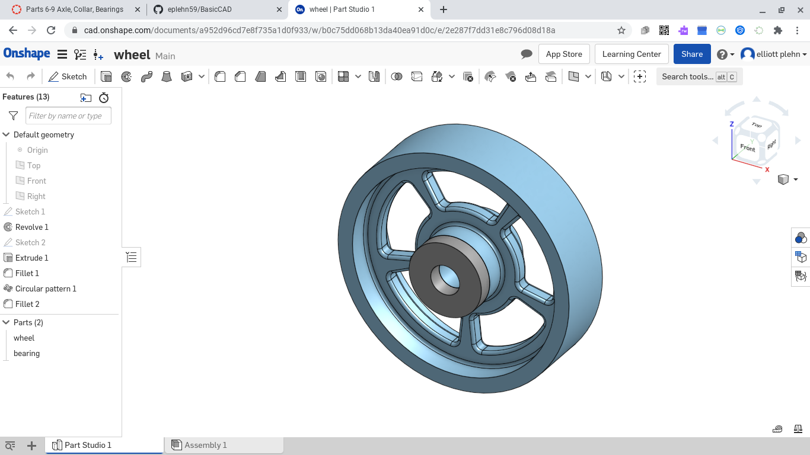

### This week I did the wheel spokes and added the bearing to it as my first assignment. As my seccond I also did the axle, collar, and bearing.

### These are the links to all of them.

[Collar and axle] https://cad.onshape.com/documents/82a2901b6145727a69d7f90e/w/5255fa6542bb145b99207af5/e/26c376516008682fc49ff73e
---
[wheel with bearing] https://cad.onshape.com/documents/a952d96cd7e8f735a1d0f933/w/b0c75dd068b13da40ea91d0c/e/2e287f7dd31e8c796d08d18a
---
[Big bearing] https://cad.onshape.com/documents/82a2901b6145727a69d7f90e/w/5255fa6542bb145b99207af5/e/26c376516008682fc49ff73e
---
### These are the screenshots I have taken of them

---

---

---

### This week I had alot of trouble with github, but I figured it out. With the onshape I had no issues and it was quite easy.
