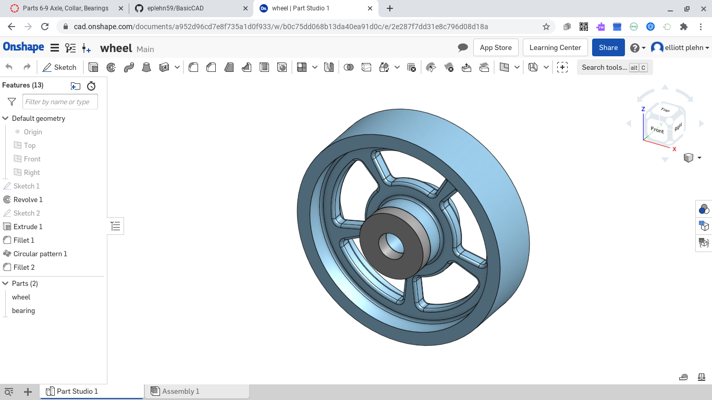

# Journal entry 1

### I struggled to get the first part to work then I realized it had to be in one sketch, then I easily finished

---

## Discription
This week I did the tire and fork, I also did the week 1 journal which got deleted. 

## Evidence
[The tire in onshape]
https://cad.onshape.com/documents/f9867f066fe4f082e2311771/w/53d94ef7635e03bf0d96d2e9/e/2fc9b7304cfe4b2a93e49bc7

[the fork in onshape]
https://cad.onshape.com/documents/669570c0f6c960f8593a1eac/w/516452f61e0aa8ad83806085/e/2b09f08dd59262233d082bce

## Images

## Reflection
When I was doing the assignment I had many set backs such as onshaoe not working, images and link trouble with github and my journal reseting. I learned if I am patient and persistant with what I do I will be more succesful then I wouold originaly. I also learned to get help from more than one sorce and not only rely on what I know, but what others know aswell

---
# journal entry 2
### This week I did the wheel spokes and added the bearing to it as my first assignment. As my seccond I also did the axle, collar, and bearing.

### These are the links to all of them.

[Collar and axle] 
https://cad.onshape.com/documents/82a2901b6145727a69d7f90e/w/5255fa6542bb145b99207af5/e/26c376516008682fc49ff73e
---
[wheel with bearing] 
https://cad.onshape.com/documents/a952d96cd7e8f735a1d0f933/w/b0c75dd068b13da40ea91d0c/e/2e287f7dd31e8c796d08d18a
---
[Big bearing] 
https://cad.onshape.com/documents/82a2901b6145727a69d7f90e/w/5255fa6542bb145b99207af5/e/26c376516008682fc49ff73e
---
### These are the screenshots I have taken of them

---

---

---

### This week I had alot of trouble with github, but I figured it out. With the onshape I had no issues and it was quite easy.

---

# journal 3

### This week I was behind and had to do my weekly journal from last week this week and the sub assembally.

### This is the link to the assembally
https://cad.onshape.com/documents/f2a0f82b863076f8b2091205/w/83a67bf825561e2a1ab6b139/e/f5754b8e4b6895b0f29269f4
---

### This is a picture of it.

---

### As a reflection of this week I think I shouldnt over think like I did last week and kept putting it off and think of it more simply like I did this week and I can get alot more work done.
---
# Journal 4 
# Basic CAD
This is the basic CAD module.
---
## Base

### The assignment
The assignment was to was to make a box with 6 holes with 120mm sides and 200mm sides.
### Picture

### Link to onshape
https://cad.onshape.com/documents/d4527b42aaded29d5ef20098/w/da7766c22e43478db3960f87/e/d727d72febda11de8dcd310c
### Reflection
I spent an hour teying to figure out onshae then I realized you had to do it all in one sketch, then I completed it quite easily

---
# journal 5
### I put together all the parts I have made and created the bottom of a shoping cart.

### Link to document:
https://cad.onshape.com/documents/021e9b1760a15eb19275d541/w/ae9cfd3dc104084b032bc3b4/e/34e2904d10070444f82fdd80

### This is a picture of it

### My reflection with this assignment was getting the measure offon one part and having to restart, the rest was easy 
---
# journal 6
### This week I did the dorthy pins because thats all we had assigned

https://cvilleschools.onshape.com/documents/895c1f241ddc66e695ecf0fb/w/f45adf4effe40c9fce92e54d/e/02ba9ebd6e951c51d5699efb

### This week was pretty easy, The dorthy pins wernt that hard, and putting it together was satisfying. Overall I enjoyed this week and think it would be fun to do something like this again. I think this week I learned that not everything thats enjoyable has to be challenging.
