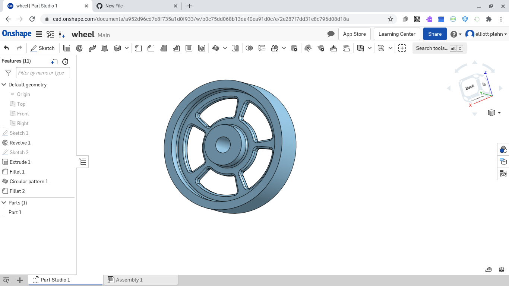

#### Today I made a wheel and added spokes to it.

### This is how it looks like

---
#### This is the link to my wheel for you to check it
https://cad.onshape.com/documents/a952d96cd7e8f735a1d0f933/w/b0c75dd068b13da40ea91d0c/e/2e287f7dd31e8c796d08d18a
---
### Something I learned today was backtracking to find your mastake isn't always the fastest, sometimes you have to start over.
---
